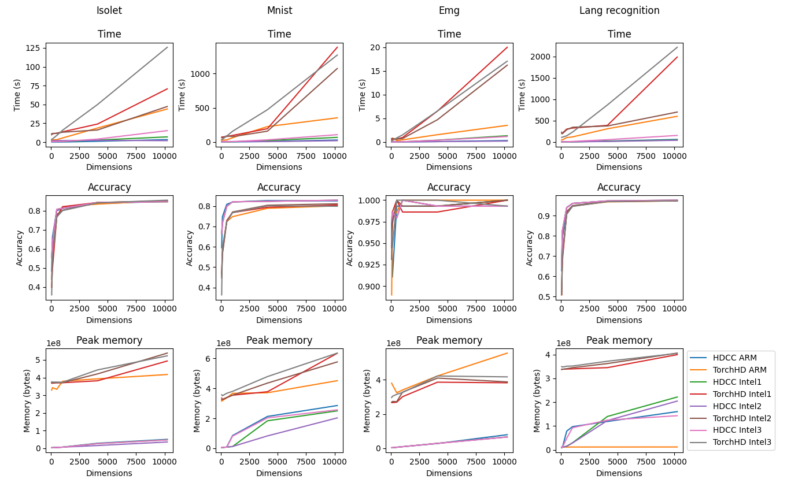

# COMPILER #

This work introduces the compiler. The compiler is an open-source Hyperdimensional 
Computing Learning Classification Task to C compiler with three distinct features 
for embedded systems and High-Performance Computing: (1) the generated C code is 
self-contained and has no library or platform dependencies, (2) the generated code
can be run using multiple threads (3) the generated code is optimized for maximum 
performance and minimal memory usage.

## COMPILER LANGUAGE SPECIFICATION ##

| Directive         | Parameters            | Required | Description                                                                                     |
|-------------------|-----------------------|----------|-------------------------------------------------------------------------------------------------|
| .NAME             | String                | YES      | Defines the name for the C output file.                                                         |
| .WEIGHT_EMBEDDING | String String Integer | YES      | Defines the weight hypervector embedding, needs name, type and size.                            |
| .EMBEDDINGS       | String String Integer | NO       | Defines optional embeddings (needs three parameters, name, type and size)                       |
| .INPUT_DIM        | Integer               | YES      | Defines the size of the input data.                                                             |
| .ENCODING         | String                | YES      | Defines the hyperdimensional encoding.                                                          |
| .CLASSES          | Integer               | YES      | Defines the number of classes to be classified to.                                              |
| .TYPE             | String                | NO       | Defines the code generation, either sequential or parallel.                                     |
| .DIMENSIONS       | Integer               | YES      | Defines the number of dimensions used for the embeddings.                                       |
| .TRAIN_SIZE       | Integer               | YES      | Defines the number of training samples.                                                         |
| .TEST_SIZE        | Integer               | YES      | Defines the number of testing samples.                                                          |
| .NUM_THREADS      | Integer               | NO       | In case of using the parallel type it defines the number of threads to be used in the execution |
| .VECTOR_SIZE      | Integer               | NO       | Defines the size of the vector for the vectorial operations.                                    |
| .DEBUG            | BOOL                  | NO       | Activates the debug logs.                                                                       |

## CURRENT IMPLEMENTATIONS ##

### VSA MODEL ###

Right now the only VSA model implemented is MAP. For future work it is planned to implement BSC and FHRR.

### EMBEDDINGS ###

| Options | Description                                                                   |
|---------|-------------------------------------------------------------------------------|
| RANDOM  | Hypervectors are sampled uniformly at random from the hyperspace              |
| LEVEL   | First and last hypervectors are sampled uniformly the rest are equally spaced |

For future work we plan to implement circular hypervectors.

### OPERATIONS ###

| Options     | Description                                                                                |
|-------------|--------------------------------------------------------------------------------------------|
| MULTIBIND   | Element-wise multiplication of two sets of hypervectors                                    |
| MULTIBUNDLE | Element-wise addition of two sets of hypervectors                                          |
| PERMUTE     | Performs a cyclic shift of a set of hypervectors                                           |
| NGRAM       | Encodes by binding n consecutive hypervectors and then performing a multiset of the ngrams |

For future work we plan to implement other encoding operations.

### PARALLEL AND SIMD OPERATIONS ###

This compiler can execute using multiple threads by using the default c library pthreads, and also performs vectorial 
operations using c intrinsics.

## EXAMPLE ##

Compiler description for the Voicehd application.

```
.NAME VOICEHD;
.WEIGHT_EMBED (VALUE LEVEL 100);
.EMBEDDING (ID RANDOM 617);
.INPUT_DIM 617;
.DEBUG TRUE;
.ENCODING MULTIBUNDLE(MULTIBIND(ID,VALUE));
.CLASSES 27;
.TYPE PARALLEL;
.DIMENSIONS 10240;
.TRAIN_SIZE 6238;
.TEST_SIZE 1559;
.VECTOR_SIZE 128;
.NUM_THREADS 4;
```

Steps to execute the voicehd application:

```
python3 ../src/main.py voicehd.hdcc
make
./voicehd ../data/ISOLET/isolet_train_data ../data/ISOLET/isolet_train_labels ../data/ISOLET/isolet_test_data ../data/ISOLET/isolet_test_labels 
```

## RESULTS ##

